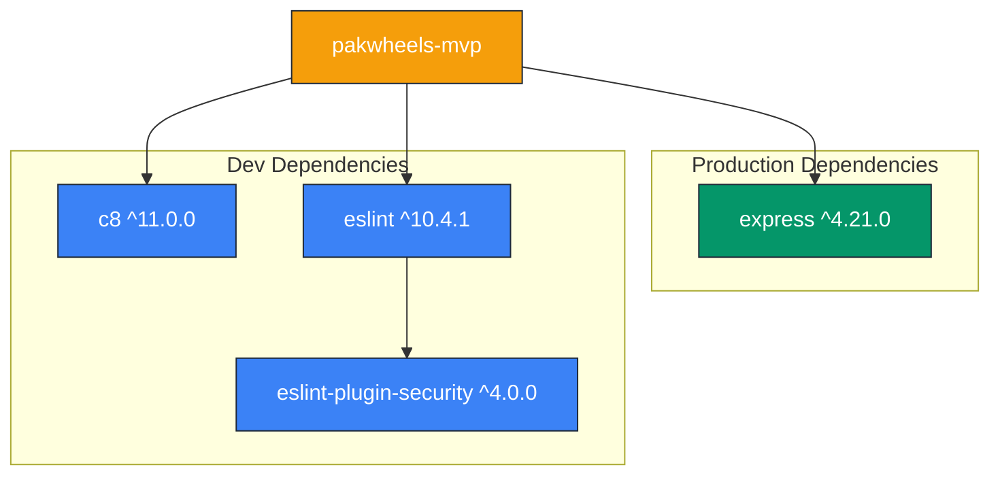

# 🚗 PakWheels MVP

A vehicle listing platform (cars & bikes) for the Pakistani market. Built with Express.js serving a RESTful API and static HTML frontend, with JSON file-based data storage.

---

## 📋 Table of Contents

- [Tech Stack](#-tech-stack)
- [Project Structure](#-project-structure)
- [Getting Started](#-getting-started)
- [API Documentation](#-api-documentation)
- [Frontend Pages](#-frontend-pages)
- [Data Storage](#-data-storage)
- [Testing](#-testing)
- [Linting](#-linting)
- [Architecture & Conventions](#-architecture--conventions)
- [Dependency Graph](#-dependency-graph)
- [Obsidian Graph](#-obsidian-graph)
- [Known Limitations](#-known-limitations)

---

## 🛠 Tech Stack

| Layer        | Technology                          |
|--------------|-------------------------------------|
| Runtime      | Node.js (no TypeScript)             |
| Framework    | Express ^4.21                       |
| Testing      | Node.js built-in `node:test` + `assert/strict` |
| Coverage     | c8                                  |
| Linting      | ESLint 10+ flat config + `eslint-plugin-security` |
| Frontend     | Vanilla HTML / CSS / JS (no framework) |
| Data Storage | JSON files (no database)            |

---

## 📁 Project Structure

```
pakwheels/
├── pakwheels-mvp/
│   ├── app.js              # Express app factory (createApp), routes & data helpers
│   ├── server.js           # Entry point — calls createApp().listen()
│   ├── eslint.config.js    # ESLint flat config with security plugin
│   ├── package.json        # Dependencies & scripts
│   ├── data/
│   │   ├── cars.json       # Car listings
│   │   ├── bikes.json      # Bike listings
│   │   ├── makes.json      # Vehicle makes (cars & bikes)
│   │   └── cities.json     # Pakistani cities
│   ├── public/
│   │   ├── index.html      # Homepage — search & featured listings
│   │   ├── car.html        # Car detail page
│   │   ├── sell.html       # Sell your vehicle form
│   │   ├── api-docs.html   # Interactive API documentation
│   │   ├── openapi.json    # OpenAPI 3.0 specification
│   │   └── logo.svg        # PakWheels logo
│   └── test/
│       ├── api.test.js     # API integration tests
│       └── data.test.js    # Data validation tests
├── .github/
│   └── instructions/       # Copilot agent instructions
├── AGENTS.md               # Agent guidelines for the project
└── README.md               # This file
```

---

## 🚀 Getting Started

### Prerequisites

- [Node.js](https://nodejs.org/) v18+ (for built-in test runner support)

### Installation

```bash
cd pakwheels-mvp
npm install
```

### Run the Server

```bash
# Production
npm start

# Development (auto-restart on file changes)
npm run dev
```

The server starts at **http://localhost:3000**.

---

## 📡 API Documentation

### Cars

| Method | Endpoint       | Description                          |
|--------|----------------|--------------------------------------|
| GET    | `/api/cars`    | List all cars (supports filtering)   |
| GET    | `/api/cars/:id`| Get a single car by ID               |
| POST   | `/api/cars`    | Create a new car listing             |

### Bikes

| Method | Endpoint        | Description                          |
|--------|-----------------|--------------------------------------|
| GET    | `/api/bikes`    | List all bikes (supports filtering)  |
| GET    | `/api/bikes/:id`| Get a single bike by ID              |
| POST   | `/api/bikes`    | Create a new bike listing            |

### Metadata

| Method | Endpoint     | Description                          |
|--------|--------------|--------------------------------------|
| GET    | `/api/makes` | List vehicle makes (`?type=car|bike`)|
| GET    | `/api/cities`| List Pakistani cities                |

### Query Parameters (Filtering)

All list endpoints (`/api/cars`, `/api/bikes`) support the following filters:

| Parameter     | Type   | Example              | Description                    |
|---------------|--------|----------------------|--------------------------------|
| `make`        | string | `?make=Toyota`       | Filter by make (case-insensitive) |
| `model`       | string | `?model=Corolla`     | Filter by model                |
| `city`        | string | `?city=Lahore`       | Filter by city                 |
| `minPrice`    | number | `?minPrice=500000`   | Minimum price                  |
| `maxPrice`    | number | `?maxPrice=5000000`  | Maximum price                  |
| `minYear`     | number | `?minYear=2015`      | Minimum year                   |
| `maxYear`     | number | `?maxYear=2023`      | Maximum year                   |
| `fuel`        | string | `?fuel=Petrol`       | Fuel type                      |
| `transmission`| string | `?transmission=Automatic` | Transmission type         |
| `search`      | string | `?search=civic`      | Text search across make, model, city |

> **Note:** All filters are additive (AND logic). Featured items are always sorted first in results.

### POST Body Example (Car)

```json
{
  "make": "Toyota",
  "model": "Corolla",
  "year": 2022,
  "price": 4500000,
  "city": "Lahore",
  "fuel": "Petrol",
  "transmission": "Automatic",
  "mileage": 25000,
  "sellerName": "Ahmed",
  "sellerPhone": "03001234567",
  "description": "Excellent condition, single owner",
  "images": ["https://example.com/car1.jpg"]
}
```

> Auto-set fields: `featured`, `isCertified`, `postedDate`, `id`

### Response Format

- **Success**: `200` or `201` with JSON body
- **Error**: `404` with `{ "error": "Message" }`

An interactive API docs page is also available at **http://localhost:3000/api-docs.html** with the OpenAPI spec at `/openapi.json`.

---

## 🖥 Frontend Pages

| Page          | URL               | Description                              |
|---------------|-------------------|------------------------------------------|
| Homepage      | `/`               | Search bar, featured & recent listings   |
| Car Detail    | `/car.html?id=X`  | Full details for a specific car          |
| Sell Vehicle  | `/sell.html`      | Form to list a car or bike for sale      |
| API Docs      | `/api-docs.html`  | Interactive API documentation            |

### Color Palette

| Color   | Hex       | Usage                    |
|---------|-----------|--------------------------|
| Amber   | `#f59e0b` | Primary accent / CTA     |
| Green   | `#059669` | Featured badge / success |
| Dark    | `#1f2937` | Headers / dark text      |

---

## 💾 Data Storage

All data is stored as JSON files in the `data/` directory — no database required.

| File          | Content                                  |
|---------------|------------------------------------------|
| `cars.json`   | Array of car listing objects             |
| `bikes.json`  | Array of bike listing objects (IDs ≥ 1001) |
| `makes.json`  | Vehicle makes with `type` (car or bike)  |
| `cities.json` | Array of Pakistani city name strings      |

Data is read/written via the `readJSON()` and `writeJSON()` helpers exported from `app.js`.

---

## 🧪 Testing

```bash
# Run all tests
npm test

# Run with coverage report
npm run coverage
```

Tests are located in `test/`:

- **`api.test.js`** — Integration tests for all API endpoints
- **`data.test.js`** — Validation tests for data integrity

> ⚠️ **Important:** Tests save/restore original JSON files. Never run tests in parallel — they share the same data files.

---

## 🔍 Linting

```bash
# Run ESLint
npx eslint .
```

The project uses ESLint 10+ with a flat config and the `eslint-plugin-security` plugin for security-focused linting rules.

---

## 🏗 Architecture & Conventions

- **App Factory Pattern**: `createApp()` in `app.js` creates and returns the Express app, making it testable without starting the server.
- **Filtering**: All query param filters are additive (AND). Case-insensitive comparisons. Featured items always sorted first.
- **ID Generation**: `Math.max(...items.map(i => i.id)) + 1` — handles empty arrays gracefully.
- **Input Validation**: `asText()`, `asInteger()`, `asTextArray()`, `asImageArray()` helpers validate and sanitize POST body fields.
- **Auto-set Fields**: `featured`, `isCertified`, `postedDate` are automatically set on POST — not client-controllable.
- **Security**: ESLint security plugin rules enforced. Inline disable for `security/detect-non-literal-fs-filename` on JSON file ops (intentional).

---

## 📊 Dependency Graph

### npm Package Dependencies



### Internal Module Dependencies

```mermaid
graph TD
    SERVER[server.js] -->|createApp| APP[app.js]
    APP -->|readJSON / writeJSON| DATA[data/*.json]
    APP -->|express.static| PUBLIC[public/*]
    APP -->|serves| API[API Routes]

    subgraph API Routes
        CARS_GET[GET /api/cars]
        CARS_ID[GET /api/cars/:id]
        CARS_POST[POST /api/cars]
        BIKES_GET[GET /api/bikes]
        BIKES_ID[GET /api/bikes/:id]
        BIKES_POST[POST /api/bikes]
        MAKES[GET /api/makes]
        CITIES[GET /api/cities]
    end

    CARS_GET -->|reads| CARS_JSON[cars.json]
    CARS_ID -->|reads| CARS_JSON
    CARS_POST -->|writes| CARS_JSON
    BIKES_GET -->|reads| BIKES_JSON[bikes.json]
    BIKES_ID -->|reads| BIKES_JSON
    BIKES_POST -->|writes| BIKES_JSON
    MAKES -->|reads| MAKES_JSON[makes.json]
    CITIES -->|reads| CITIES_JSON[cities.json]

    subgraph Frontend
        INDEX[index.html] -->|fetch| API
        CAR[car.html] -->|fetch| API
        SELL[sell.html] -->|POST| API
        APIDOCS[api-docs.html] -->|reads| OPENAPI[openapi.json]
    end

    subgraph Tests
        API_TEST[api.test.js] -->|imports| APP
        DATA_TEST[data.test.js] -->|reads| DATA
    end

    style SERVER fill:#f59e0b,stroke:#1f2937,color:#fff
    style APP fill:#059669,stroke:#1f2937,color:#fff
    style DATA fill:#ef4444,stroke:#1f2937,color:#fff
    style PUBLIC fill:#8b5cf6,stroke:#1f2937,color:#fff
    style API fill:#3b82f6,stroke:#1f2937,color:#fff
```



---

## 🔮 Obsidian Graph

The obsidian graph below visualizes how all concepts, modules, and data entities in the project are interconnected — similar to an Obsidian vault knowledge graph.

```mermaid
graph LR
    %% Core Modules
    SERVER[server.js]
    APP[app.js]
    ESLINT_CFG[eslint.config.js]

    %% Data Layer
    CARS[cars.json]
    BIKES[bikes.json]
    MAKES[makes.json]
    CITIES[cities.json]

    %% Frontend Pages
    INDEX[index.html]
    CAR[car.html]
    SELL[sell.html]
    APIDOCS[api-docs.html]
    OPENAPI[openapi.json]

    %% API Endpoints
    API_CARS[/api/cars]
    API_BIKES[/api/bikes]
    API_MAKES[/api/makes]
    API_CITIES[/api/cities]

    %% Validation Helpers
    ASTEXT[asText]
    ASINT[asInteger]
    ASTEXTARR[asTextArray]
    ASIMGARR[asImageArray]

    %% Test Files
    API_TEST[api.test.js]
    DATA_TEST[data.test.js]

    %% NPM Packages
    EXPRESS_PKG[express]
    C8_PKG[c8]
    ESLINT_PKG[eslint]
    SEC_PKG[eslint-plugin-security]

    %% Relationships
    SERVER --- APP
    APP --- CARS
    APP --- BIKES
    APP --- MAKES
    APP --- CITIES
    APP --- API_CARS
    APP --- API_BIKES
    APP --- API_MAKES
    APP --- API_CITIES
    APP --- ASTEXT
    APP --- ASINT
    APP --- ASTEXTARR
    APP --- ASIMGARR
    APP --- EXPRESS_PKG

    API_CARS --- CARS
    API_BIKES --- BIKES
    API_MAKES --- MAKES
    API_CITIES --- CITIES

    INDEX --- API_CARS
    INDEX --- API_BIKES
    CAR --- API_CARS
    SELL --- API_CARS
    SELL --- API_BIKES
    SELL --- API_MAKES
    SELL --- API_CITIES
    APIDOCS --- OPENAPI

    API_TEST --- APP
    DATA_TEST --- CARS
    DATA_TEST --- BIKES
    DATA_TEST --- MAKES
    DATA_TEST --- CITIES

    ESLINT_CFG --- ESLINT_PKG
    ESLINT_CFG --- SEC_PKG

    %% Styling
    style SERVER fill:#f59e0b,stroke:#1f2937,color:#fff
    style APP fill:#f59e0b,stroke:#1f2937,color:#fff
    style CARS fill:#ef4444,stroke:#1f2937,color:#fff
    style BIKES fill:#ef4444,stroke:#1f2937,color:#fff
    style MAKES fill:#ef4444,stroke:#1f2937,color:#fff
    style CITIES fill:#ef4444,stroke:#1f2937,color:#fff
    style INDEX fill:#8b5cf6,stroke:#1f2937,color:#fff
    style CAR fill:#8b5cf6,stroke:#1f2937,color:#fff
    style SELL fill:#8b5cf6,stroke:#1f2937,color:#fff
    style APIDOCS fill:#8b5cf6,stroke:#1f2937,color:#fff
    style OPENAPI fill:#8b5cf6,stroke:#1f2937,color:#fff
    style API_CARS fill:#3b82f6,stroke:#1f2937,color:#fff
    style API_BIKES fill:#3b82f6,stroke:#1f2937,color:#fff
    style API_MAKES fill:#3b82f6,stroke:#1f2937,color:#fff
    style API_CITIES fill:#3b82f6,stroke:#1f2937,color:#fff
    style ASTEXT fill:#059669,stroke:#1f2937,color:#fff
    style ASINT fill:#059669,stroke:#1f2937,color:#fff
    style ASTEXTARR fill:#059669,stroke:#1f2937,color:#fff
    style ASIMGARR fill:#059669,stroke:#1f2937,color:#fff
    style API_TEST fill:#6366f1,stroke:#1f2937,color:#fff
    style DATA_TEST fill:#6366f1,stroke:#1f2937,color:#fff
    style EXPRESS_PKG fill:#94a3b8,stroke:#1f2937,color:#fff
    style C8_PKG fill:#94a3b8,stroke:#1f2937,color:#fff
    style ESLINT_PKG fill:#94a3b8,stroke:#1f2937,color:#fff
    style SEC_PKG fill:#94a3b8,stroke:#1f2937,color:#fff
    style ESLINT_CFG fill:#94a3b8,stroke:#1f2937,color:#fff
```

**Legend:**
| Color     | Category              |
|-----------|-----------------------|
| 🟡 Amber  | Core entry modules    |
| 🔴 Red    | Data files (JSON)     |
| 🟣 Purple | Frontend pages        |
| 🔵 Blue   | API endpoints         |
| 🟢 Green  | Validation helpers    |
| 🔵 Indigo | Test files            |
| ⚪ Gray   | NPM packages & config |

---

## ⚠️ Known Limitations

- **No database**: Data is stored in JSON files — not suitable for production scale.
- **No seller validation**: POST endpoints don't validate seller fields thoroughly.
- **Hardcoded makes in sell.html**: The sell form has hardcoded make options instead of fetching from `/api/makes`. If adding makes, update both `makes.json` and the HTML.
- **Integer-only prices**: Uses `parseInt()` — no decimal handling for prices.
- **Timezone-dependent dates**: `postedDate` uses `new Date().toISOString().split('T')[0]` which is timezone-dependent.
- **No authentication**: No user auth or session management in this MVP.

---

## 📄 License

This project is for demonstration purposes.
